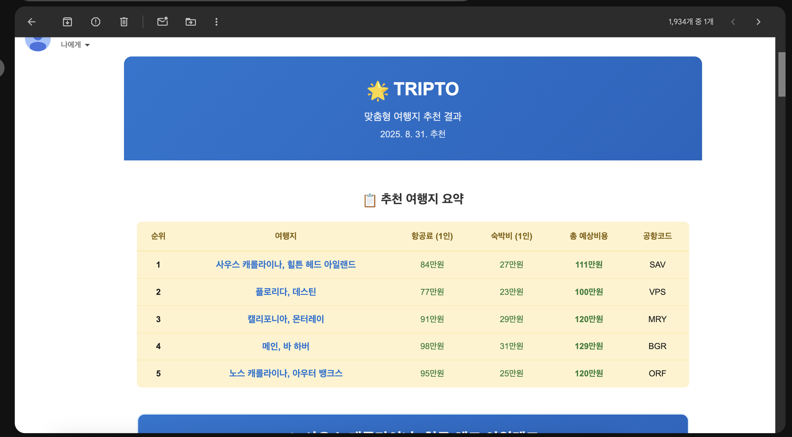

# 🌍 TripTo Lite - AI 기반 여행지 추천 서비스

> 설문을 통해 맞춤형 여행지와 관련 브이로그를 추천받고, 쉽고 빠르게 예약으로 이동해보세요!

## ✨ 주요 기능

### 🎯 개인 맞춤을 위한 설문 시스템
- **기본 질문**: 여행 스타일, 선호 활동, 예산 등 필수 정보
- **추가 질문**: 세부 선호사항을 위한 선택형/입력형 질문 

### 🤖 AI 기반 여행지 분석
- **Google Gemini AI** 활용한 분석
- 설문 답변을 바탕으로 한 개인화된 추천 로직
- 다양한 여행지 옵션과 상세한 추천 이유 제공

### 📺 관련 영상 추천
- **YouTube Data API** 연동
- 추천된 여행지별 관련 영상 자동 검색
- 여행 전 미리 체험할 수 있는 시각적 정보 제공

### 📧 추천 결과 이메일 전송
- 분석 결과를 이메일로 전송
- 언제든 다시 확인할 수 있는 개인 아카이브


## 🎨 실제 서비스 화면 예시

<p align="center">
	
	
	
	
	
	
</p>

<hr>

<p align="center">
	
    <br>
    - 이메일로 받기를 이용해 추천받은 여행지 카드를 이메일로 받아볼 수 있습니다.
</p>

## 🎯 사용법

1. **설문 시작**: 메인 페이지에서 설문 시작
2. **기본 질문 답변**: 여행 스타일, 예산 등 필수 정보 입력
3. **추가 질문 답변**: 세부 선호사항 선택 (선택사항)
4. **결과 대기**: AI 분석 과정
5. **결과 확인**: 맞춤형 여행지 추천과 브이로그 추천
6. **이메일 전송**: 결과를 이메일로 저장

## 🏗️ 프로젝트 구조

```
tripTo_lite/
├── client/                    # React 프론트엔드
│   ├── src/
│   │   ├── components/        # React 컴포넌트
│   │   │   ├── MainPage.js    # 메인 페이지
│   │   │   ├── ResultPage.js  # 결과 페이지  
│   │   │   └── Survey.js      # 설문 컴포넌트
│   │   ├── hooks/             # 커스텀 훅
│   │   │   └── useNavigation.js # 네비게이션 훅
│   │   ├── utils/             # 유틸리티 함수
│   │   │   └── emailUtils.js  # 이메일 유틸
│   │   ├── App.js             # 메인 앱 컴포넌트
│   │   ├── surveyQuestions.js # 설문 질문 데이터
│   │   └── index.js           # React 진입점
│   ├── public/
│   │   └── index.html         # HTML 템플릿
│   ├── package.json           # npm 의존성
│   └── package-lock.json      # 잠긴 의존성 버전
├── server/                    # Flask 백엔드
│   ├── app.py                 # Flask 서버
│   ├── requirements.txt       # Python 의존성
│   ├── .env.example          # 환경 변수 템플릿
│   └── .env                  # 환경 변수 (git에서 제외)
├── .gitignore                # Git 제외 파일 목록
├── README.md                 # 프로젝트 문서
└── LICENSE                   # MIT 라이선스
```

### 📁 핵심 파일 구성 (최종 정리 완료)

#### ✅ 실행 파일들 (8개)
- **App.js**: 메인 애플리케이션 로직, 상태 관리, 페이지 라우팅
- **components/MainPage.js**: 랜딩 페이지, 스크롤 기반 네비게이션
- **components/Survey.js**: 설문 컴포넌트, 폼 검증, 로딩 화면
- **components/ResultPage.js**: 결과 표시, 유튜브 영상 연동, 이메일 기능
- **hooks/useNavigation.js**: 브라우저 히스토리 관리 커스텀 훅
- **utils/emailUtils.js**: 이메일 전송 유틸리티
- **surveyQuestions.js**: 설문 질문 데이터 정의
- **index.js**: React 애플리케이션 진입점

## ⚡ React

### ✅
- **React 18**: (`react: ^18.0.0`)
- **함수형 컴포넌트**: 모든 컴포넌트 함수형으로 구현
- **Hooks 활용**: `useState`, `useEffect`, `useRef` 등 활용
- **커스텀 훅**: `useNavigation` 훅으로 로직 재사용
- **JSX**: SX 문법 사용
- **컴포넌트 분리**: 관심사별로 적절히 분리

### 🏗️ 아키텍처 패턴
```javascript
// 메인 앱 구조
App.js (메인 컨트롤러)
├── MainPage.js (랜딩)
├── Survey.js (설문)
└── ResultPage.js (결과)

// 상태 관리
- React Hook 기반 로컬 상태
- localStorage 연동 (설문 답변 저장)
- 컴포넌트 간 props 전달

// 라우팅
- 커스텀 훅 기반 SPA 라우팅
- 브라우저 히스토리 API 활용
- 페이지별 상태 관리
```
 
## 🛠️ 기술 스택

### Frontend
- **React 18**
- **JavaScript ES6+**
- **CSS-in-JS**

### Backend  
- **Flask**
- **Google Gemini AI**
- **YouTube Data API**
- **SMTP**

